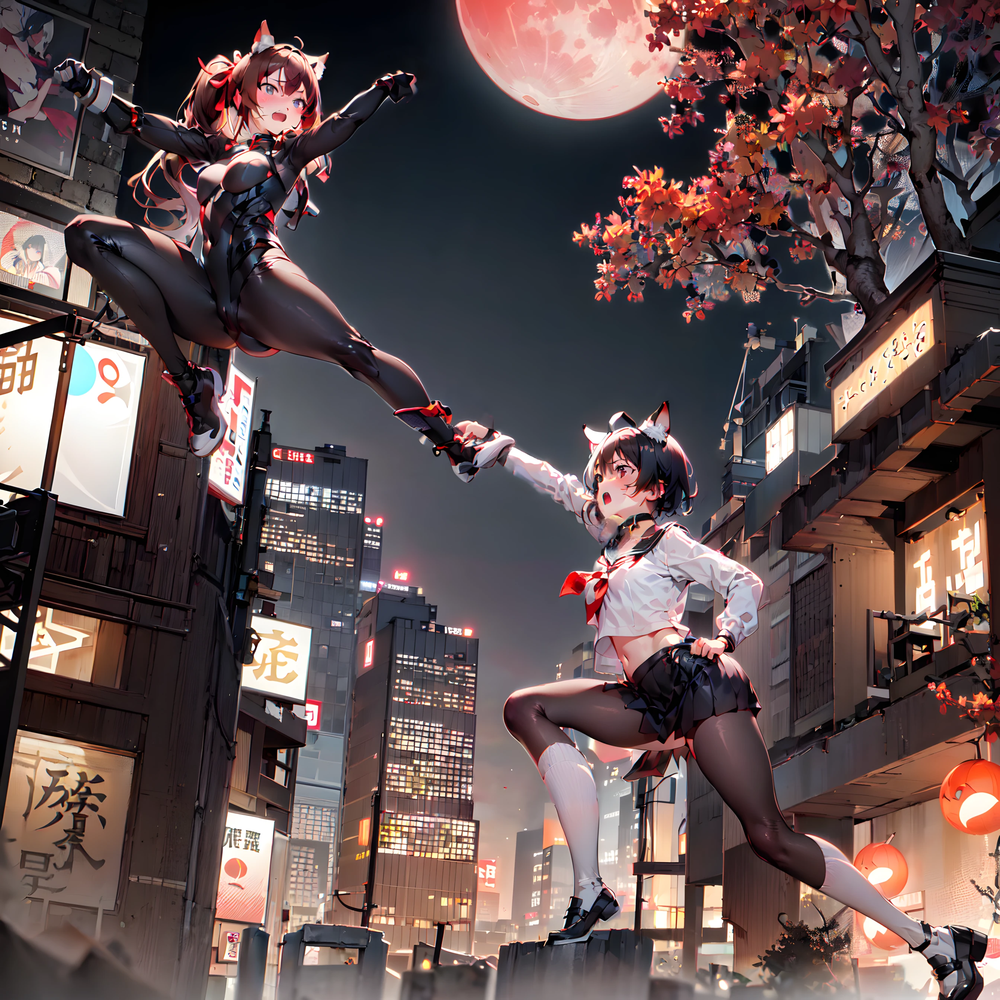

# 黒猫耳キャラと茶猫耳キャラのLora

黒猫耳キャラと茶猫耳キャラのLora一式です。

参考URL: https://github.com/Zuntan03/CharFramework

- 5タイプのLoRA
	- krnk: 黒猫耳の顔 (KuRoNeKo)
	- tyank: 茶猫耳の顔 (TYANeKo)
	- krnksf: 黒猫耳のセーラー服 (KuRoNeKo SeraFuku)
	- tyankps: 茶猫耳のプラグスーツ (TYANeKo PlugSuit)
	- krnksf_tyankps: 黒猫耳のセーラー服と茶猫耳のプラグスーツのグループLoRA
- 各タイプ別に3種類の学習
	- Lora3x3: [Kohya版 LoRA](https://github.com/kohya-ss/sd-scripts)の[Conv2d 3x3拡張](https://github.com/kohya-ss/sd-scripts/blob/main/train_network_README-ja.md#lora-%E3%82%92-conv2d-%E3%81%AB%E6%8B%A1%E5%A4%A7%E3%81%97%E3%81%A6%E9%81%A9%E7%94%A8%E3%81%99%E3%82%8B) 圧縮版 約40MB
	- Locon: [LyCORIS](https://github.com/KohakuBlueleaf/LyCORIS) Locon 約200MB強
	- Loha: [LyCORIS](https://github.com/KohakuBlueleaf/LyCORIS) LoHa 約100MB弱
- 層別適用済み
	- 顔LoRA
		- FACE:0,1,1,1,1,1,0,0,0,1,0,0,0,0,1,0,1,1,1,0,1,1,1,0,0,1
	- 体LoRAとグループLoRA
		- BODY:0,1,1,1,0,1,0,0,0,1,0,0,0,0,0,0,1,1,1,1,1,1,1,0,0,1
- Lora3x3はresize_loraのsv_ratio=16で圧縮済み
	- 元画像の再現を優先する場合はsv_ratioを32や64に上げればよい（それでもサイズは十分に小さくなる）のですが、ノイズのような学習が除去されているようにみえるので16まで下げています。
		- 8まで下げた場合は再現不足を感じました（個人の感想です）。
- 「./image」に出力画像があります。

# 利用方法

- Lora3x3とLoconはWebUIは[Additional Networks拡張](https://github.com/kohya-ss/sd-webui-additional-networks)から使用できます。
	- **Additional Network拡張でLoRAを開くと、各LoRAの使い方を確認できます。**
- WebUIの花札マークから使用したい場合は[a1111-sd-webui-locon](https://github.com/KohakuBlueleaf/a1111-sd-webui-locon)を導入してください。
- キーワードは各ファイル名先頭の「krnk」「tyank」「krnksf, krnk」「tyankps, tyank」「krnksf, tyankps, krnk, tyank」
	- 最後の「krnksf, tyankps」のグループLoRAは、Latent CoupleとControlNetを併用して「krnksf」と「tyankps」を呼び分けます。

# 他の主な学習パラメータ

素材により適切な値は変化します。

- LoRA Dreambooth方式の正則化画像なし
- 素材枚数（バッチ処理で縮小した画像あり）
	- krnk: 15枚、tyank: 12枚
	- krnksf, tyankps: ↑ + 12枚
- network_dim = conv_dim:
	- Lora3x3: 128
	- Locon: 128
	- Loha: 32
- network_alpha = conv_alpha: network_dimの50%
- learning_rate: 100e-6 (1e-4)
- text_encoder_lr: 44e-6 (4.4e-5)
- max_train_steps:
	- 顔LoRA: 1000
	- 体LoRA: 1200
	- グループLoRA: 1600
- color_aug, flip_aug, enable_bucket, bucket_no_upscaleなどが有効
- shuffle_captionやkeep_tokensは無効

# 出力例

