# AI画像生成でキャラクターの扱いをしくみ化してフレームワークにしてみる

AI画像生成のキャラクターをコンテンツ制作で効率的に扱うしくみ（つまりフレームワーク）を作ってみました。
まずは[こちらのTwitterスレッド](https://twitter.com/Zuntan03/status/1640240599323541504)をご覧ください。

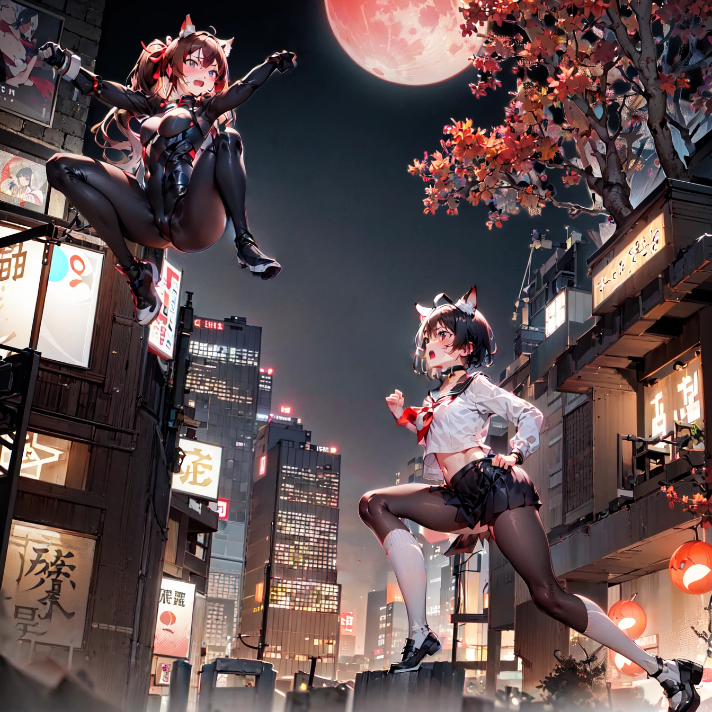

アニメやゲームやマンガなどの物語のあるコンテンツの制作では、キャラクターを効率的に扱えることが求められます。
例えばキャラの服を自由に着替えたり、異なるシチュエーションで複数のキャラを同じように扱えたりです。


このようなコンテンツの制作ではキャラのつくり方やつかい方をしくみにすることで、性質を揃えた複数のキャラクターを効率的に扱えるようにしています。
そして、このしくみ自体を改善することで、さらなる効率化を進めています。

AI画像生成においてもキャラクターの扱いをしくみにできそうでしたので、フレームワークを作ってみました。

# キャラフレームワークの概要

- キャラの性質を揃えて、物語などに沿って着替えや複数キャラを扱いやすくします。
- 顔LoRA、体LoRA、グループLoRAと前段階のLoRAを使って、より楽に次のLoRAを作ります。
	- LoRA学習でのタグ付けを、フレームワークで不要にします。
	- LoRAの階層マージや、LoRAの圧縮（学習ノイズ除去？）も実施しています。
- キャラの扱いをしくみとしてフレームワークにすることで、しくみ自体の改善で制作を継続的に効率化します。
	- これが一番重要で、しくみにすることで試行錯誤を資産として残せるようになります。

# キャラフレームワークの流れ

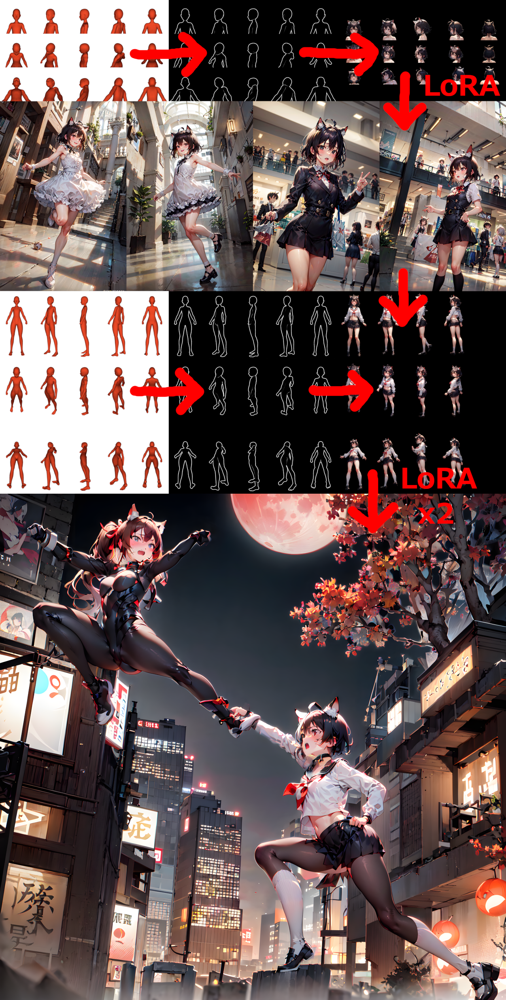

1. ルールに沿って顔LoRAを作る
	- 特定の顔に様々な服を着せやすくなります。
	
	
1. ルールに沿って顔LoRAと服をあわせた体LoRAを作る
	- 異なる体LoRAを同じように扱えるようになります。
	
1. 複数の体LoRAを組み合わせてグループLoRAを作る
	- 一枚の絵に複数のキャラを簡単に出現させられます。
	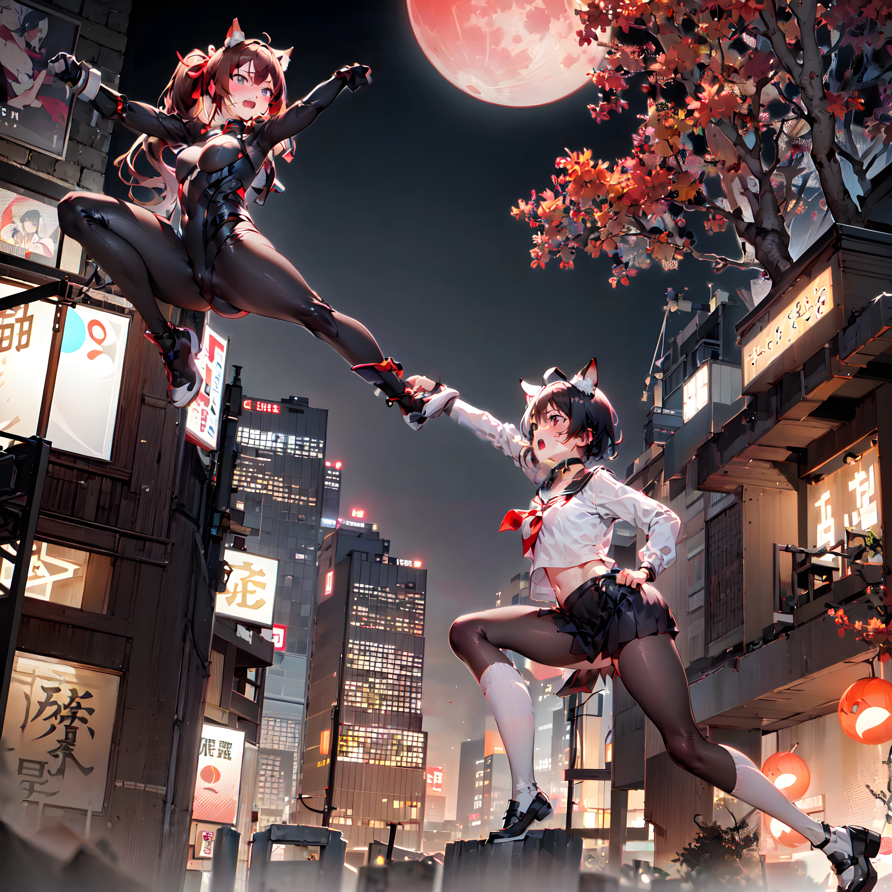
	- LoRAの部分適用などが簡単に使えるようになれば、キャラのグループ化は不要になります。
		- 現時点でも頑張ればグループLoRAなしで複数のキャラをだせますが、頑張らなくても出せるようにLoRAを作っています。
		- キャラ以外の要素とのグループ化にも可能性がありそうです。
1. 均質化されたキャラを使って、より効率的にコンテンツを作る
	- コンテンツ制作の経験から、しくみ自体をさらにブラッシュアップします。

# サンプルLoRAとサンプルLoRAの学習環境

このリポジトリはキャラフレームワークの試作実験リポジトリです。
キャラフレームワークを実際に使って作ったLoRAと、LoRAの学習環境をダウンロードできます。

## サンプルLoRA

黒猫耳キャラと茶猫耳キャラの顔と体に対して、それぞれ12枚のみの画像で作成したLoRAです（黒猫の顔のみ15枚）。

黒猫顔、茶猫顔、黒猫制服、茶猫プラグスーツ、黒猫制服＆茶猫プラグスーツの5種類があります。
それぞれの種類に[Kohya版 LoRA](https://github.com/kohya-ss/sd-scripts)の[Conv2d 3x3拡張](https://github.com/kohya-ss/sd-scripts/blob/main/train_network_README-ja.md#lora-%E3%82%92-conv2d-%E3%81%AB%E6%8B%A1%E5%A4%A7%E3%81%97%E3%81%A6%E9%81%A9%E7%94%A8%E3%81%99%E3%82%8B)、[LyCORIS](https://github.com/KohakuBlueleaf/LyCORIS) LoconとLohaの3種類があります。


私のイチオシは[Kohya版 LoRA](https://github.com/kohya-ss/sd-scripts)の[Conv2d 3x3拡張](https://github.com/kohya-ss/sd-scripts/blob/main/train_network_README-ja.md#lora-%E3%82%92-conv2d-%E3%81%AB%E6%8B%A1%E5%A4%A7%E3%81%97%E3%81%A6%E9%81%A9%E7%94%A8%E3%81%99%E3%82%8B)です（2023/03/24時点）。

- サンプルLoRAの[ダウンロード](https://yyy.wpx.jp/m/lora-20230327/KuronekoTyanekoLora-20230327.zip)
	- WebUIの[Additional Networks拡張](https://github.com/kohya-ss/sd-webui-additional-networks)から利用できます。
		- WebUIの花札マークから使用したい場合は[a1111-sd-webui-locon](https://github.com/KohakuBlueleaf/a1111-sd-webui-locon)を利用します。
	- Kohya版はの圧縮済み **40M** で、Loconは **203MB** 、LoHaは **96MB** です。
		- **Kohya版の圧縮ではノイズ的な不要な学習が圧縮時に除去されていて、扱いやすくなっている気がします。**
	- すべて（雰囲気で）階層マージ済みです。
		- FACE:0,1,1,1,1,1,0,0,0,1,0,0,0,0,1,0,1,1,1,0,1,1,1,0,0,1
		- BODY:0,1,1,1,0,1,0,0,0,1,0,0,0,0,0,0,1,1,1,1,1,1,1,0,0,1
	- [README-KuronekoTyanekoLora.md](./README-KuronekoTyanekoLora.md): サンプルLoRAに同じファイルがあります。		

## サンプルLoRAの学習環境

サンプルLoRAの学習環境は学習素材や学習設定ファイルを含んでおり、このリポジトリに上書き展開すると実際に学習できます。
InstallSdScripts.batとInstallLyCORIS.batでsd-scriptsとLyCORISをインストールしてから、LearnKuronekoTyank*.batで学習します。
ただし、ノウハウの共有が目的であり、学習環境自体の提供やサポートは意図していません。

- サンプルLoRAの学習環境の[ダウンロードページ](https://yyy.wpx.jp/m/lora.html)
	- 学習タグを自動付与しています。
	- 学習設定ファイルのtomlを自動生成しています。
	- [README-KuronekoTyanekoLearnEnv.md](./README-KuronekoTyanekoLearnEnv.md): サンプルLoRAの学習素材に同じファイルがあります。

# 注意事項

- 再現できないキャラを再現する話ではありません。
	- 再現できるキャラの再現方法をしくみ化して、キャラの扱いを効率化する話です。
- 「キャラLoRAをこのように作りましょう」といった話ではありません。
	- あなたが制作するコンテンツでAI画像生成を利用するにあたって、あなたの状況に合わせた手法を、あなた自身が構築・改善できるようになってきたことを実証する実験です。
- 今回の手法は「今やったらこうなった」だけの話です。
	- AI画像生成の技術はものすごい勢いで進化していますので、数カ月後には異なる手法が適切になる見込みです。例えば3ヶ月前に同じことをしようとしたら、全く異なる手法になります。この記事を書いている途中ですら何度も変わりました。
	- ただし、「AI画像生成を継続的なコンテンツ制作で活用するために、キャラの扱いをしくみ化する」といった考え方は、まだしばらく残りそうな気がします（が、あっという間にあれもこれもAIがやってくれるようになるかもしれません）。
- 実証実験の結果と考え方の共有が目的であり、フレームワーク自体を共有する意図はありません。
	- 私が私の制作するコンテンツのために変更を加えることはあり得ますが、フレームワーク自体の共有・サポート・要望対応などを意図したものではありません。

# 顔LoRAを作る

同じような質の顔LoRAを作るために、同じような顔の学習画像を用意します。
これまでは同じような顔の学習画像を用意するのが難しかったのですが、ControlNetでより楽に用意できるようになりました。


## 顔LoRAの学習用画像の条件

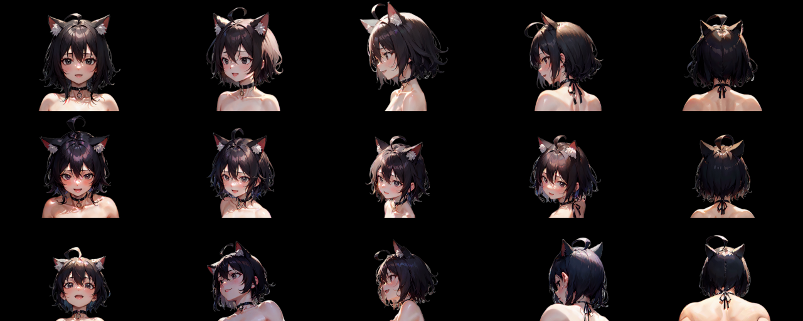
注: この画像は胸の部分を切り取っています。

- 全周から見た全裸の上半身
	- 左右対称キャラなら学習オプションの --flip_aug で片側の画像を減らせます。
		- 制作するコンテンツで真後ろからの表示が必要ないのであれば、AI画像生成で用意するのが面倒な真後ろからの画像をスキップしても構いません。例えば猫耳の裏面はガチャ率低めでした。
	- 全裸を強制することで顔以外の見えているものが固定され、これにより学習用のタグも固定します。
		- 学習に胸を含めることで、画像生成時の胸サイズ指定の悪影響で胸が露出することを防ぎます。
- 背景を透過した黒背景または白背景
	- 背景を画像生成に影響させないために、黒背景または白背景にします。
		- 髪の毛などのエッジで背景のにじみが目立ちやすいので、暗い髪色なら黒背景、明るい髪色なら白背景が良さそうです。絵柄によっては黒背景のにじみはアウトライン扱いにもできるかもしれません。
	- 背景を透過にしているのは、画像編集ツールで背景を扱いやすくするためです。学習用ではありません。

以降ではControlNetを使って条件を満たす顔画像を生成しますが、条件を満たしていれば手書きのイラストでも、なにかのスクリーンショットでも問題ないはずです。

## 顔LoRAの学習用画像の生成

学習用画像の生成では「/FaceTemplate」にある「f??.png」をControlNetに設定して、構図が似るように画像を生成します。

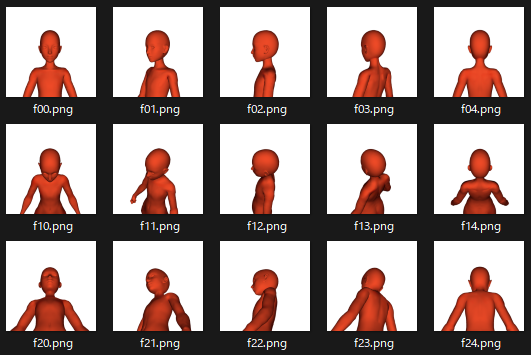

- ファイル名の1文字目の「f」は顔画像を指します。
- ファイル名のfに続く1桁目の数値は「0」が水平、「1」が上から、「2」が下からの画像になります。2桁目の数値は「0」が正面で45度ずつ反時計回りで角度が変わります。
	- 左右対称キャラ用のデータです。左右非対称のキャラの場合はf?3 f?2 f?1を水平反転してf?5 f?6 f?7を作成します。プロンプトの説明なども同様に読み替えます。
- 「/FaceControlNet」にControlNetのPreporcess済みの画像がありますが、通常は使用しません。Preprocss結果を改変した際の影響調査などに使用していました。Segは手作りですので、マスク作成などに役立つかもしれません。
	- NormalとDepthは3Dから用意したものではなく、ControlNetのPreprocessで2Dから擬似的に算出したものですので、信用しないでください。
	- Preprocessorも随時更新されますので、最新のPreprocessorで出力したほうが結果が良いかもしれません。
- ファイル名の4文字目以降は、自由に名前を付けられます（使用文字は英数字とハイフン&アンダーバーあたりが無難です）。
	- ファイル名の4文字目以降を変えて、より学習させたい構図の画像を複数枚用意することもできます。

ControlNetのモデルは「control_sd15_hed」を512pxの解像度で使用しました。

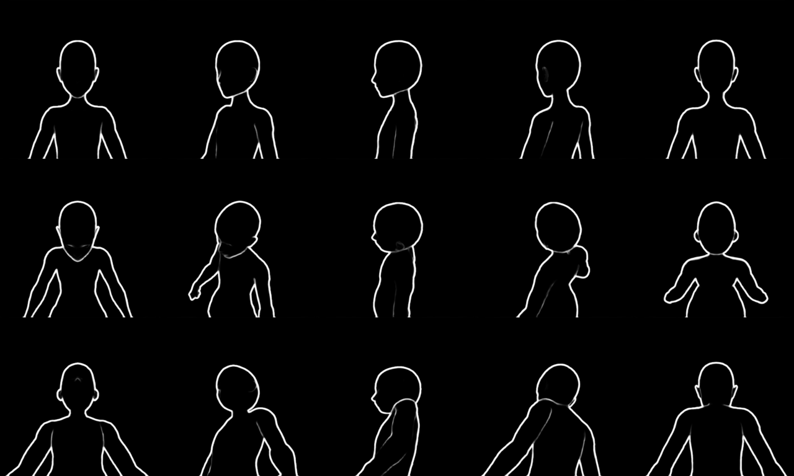

- Hedは解像度を下げると描画の自由度が上がる特性があるようです。ポーズを矯正しつつ髪や装飾を生やせる解像度を選択してください。今回は512pxのHedを使用しました。
- Hedの「Weight」は0.4～0.6、「Guidance Start」は0、Guidance Endは0.3にしています。
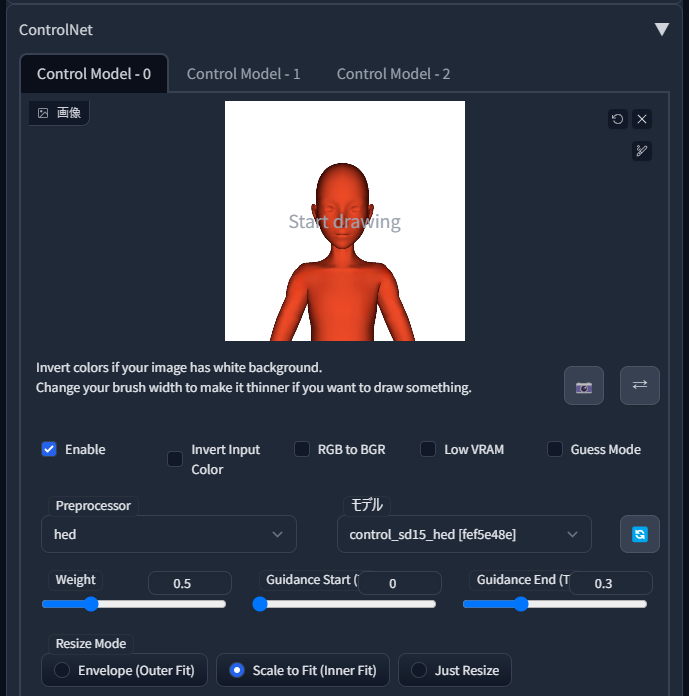
	- 学習用顔画像の生成にLoRAを使用するなどにより、Weightなどのパラメータを調整することがあります。
		- 例えばある程度良い感じの髪やポーズの画像を生成できた場合に、この生成した画像をControlNetの元画像に指定して「hed」でPrefrocessします。そうするとより詳細なHed画像が生成されますので、Weightを0.3ぐらいまで下げたりしました。
	- 「Weight」の効果は「CFGスケール」やプロンプトのトークン数からも影響を受けるようです。
		- 迷ったら「スクリプト」の「X/Y/Z plot」を使って、「\[ControlNet] Weight」や「CFGスケール」や「ノイズ除去」の周辺値を調査します。

- Hed（やCannyやDepthやNormal）の背景がシンプルになる効果を利用しています。
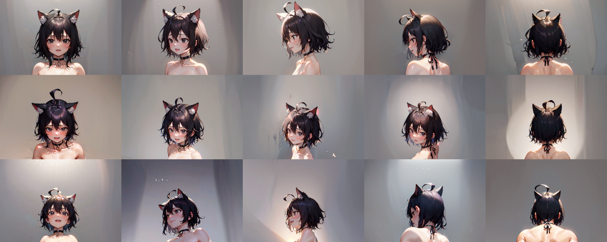
	- このぐらいシンプルな背景だと、背景の画像処理が比較的容易になります。
	- Hedの「Guidance Start」を上げたり「Weight」を下げすぎると、より詳細な背景が描画されてしまい、後で背景の画像処理が難しくなりますので、ご注意ください。
	- 他にも背景を抜く手法はいろいろあるようです。結果的に背景を塗りつぶせればどのような手法でも問題ありません。
		- Hedはどうしてもシルエットの影響を受けてしまうので、openposeを使いつつ背景をなんとか抜く手法のほうが良さそうです。

### 顔LoRAの学習用画像の生成プロンプト

基本的には使用するモデルの作者がおすすめするプロンプトや設定を使います。
ControlNetでポーズを縛りつつも髪の毛などでアウトラインを崩したいため、「CFGスケール(8~14)」や「高解像度補助」の「ノイズ除去強度(0.6～0.8)」をモデル作者の指定より高める場合があります。

カッコ内に私が使った強度を記載していますが、状況によって値は変わりますので参考程度にしてください。
値に迷った時点で「X/Y/Z plot」で調べるのが安全です。

- すべてに「(black background: 1.3), simple background, upper body」
	- 白背景なら「white background」。
-  全裸になるまで「(nude, completely nude, naked: 1.4)」など
- 「f1?」なら上からなので「(from above: 1.3)」、「f2?」なら下からなので「(from below: 1.3)」
- 「f?2」なら横からなので「from side」、「f?\[34]」なら後ろからなので「(from behind: 1.3)」
- 「f?0」以外に「looking away」
	- 「f?0」は「looking at viewer」だが、指定しなくともビューアを見がち。
- 表情の学習をタグに吸わせるための、なんらかの表情指定
	- 「smile, blush, open mouth」で試したが失敗気味、口元がゆるくて頬の赤みが髪に移る。

これらにキャラ再現用のプロンプトを足して、生成画像を見ながらプロンプトを調整します。

```
キャラ再現用プロンプト例:
1girl, upper body, short hair, cat ears, black choker, flat chest, black eyes, hair between eyes, ear fluff, (ahoge: 0.1)」
```

- 寝転がってしまうなら「standing」
- 筋肉が気になるならネガティブに「(muscle: 1.4)」
- 不要な髪飾りが気になるならネガディブに「hair ornament」

条件を満たした顔画像であれば、どのようなプロンプトや設定で生成しても問題ありません。

## 生成した顔画像の後処理

生成した画像の後処理は、背景を塗りつぶすのが主な作業になります。
以下は背景の塗りつぶしに使える無料ツールですが、あなたの好きなツールで塗りつぶしてください。

- WebUI拡張の [sd_katanuki](https://github.com/aka7774/sd_katanuki)
	- AI任せでフォルダにある画像の背景を、まとめて処理できます。
	- 実験途中に [rembg](https://github.com/AUTOMATIC1111/stable-diffusion-webui-rembg) がでたり、その切り抜きノイズを削除するツールがでたり。
- [GIMP](https://www.gimp.org/)
	- オープンソースの画像レタッチソフトです。
- [Lama Cleaner](https://github.com/Sanster/lama-cleaner)
	- 背景に飛び出た指や装飾など、不要なモノを削除できます。

髪の毛の隙間を抜くのが手間で難しいのですが、Photoshopが有能らしいので次の機会では試してみたいですね。

AI画像生成以外のツール・ゲーム・手書きといった手段で画像を用意するのであれば、背景処理を省けます。

一通りの後処理が済んだら、[GIMP](https://www.gimp.org/)の[BIMP](https://alessandrofrancesconi.it/projects/bimp/)などで一括で縮小画像を用意します。縮小作業は手作業でやるべからず。

## 顔画像の自動タグ付け

顔の画像が用意できたら「/GenerateCharTag.bat」に画像の入ったフォルダをドラッグ＆ドロップして、自動でタグ付けします。
生成時のプロンプトと似たタグ付けをしますが、キーワードに学習させたくない要素をタグ付けするため、一部が異なります。

1. キーワード（画像の入ったフォルダ名の先頭部分）
1. 「white background, black background, simple background」
	- 白背景と黒背景の両対応にしています。
		- white backgroundやblack backgroundを、コンテンツ制作では使わない想定です。
	- 色が最大限異なる背景タグを合わせて指定することで、学習が強化されて背景タグに背景をより吸い取ってもらえているような気もしますが、気のせいかもしれません。AI「なんやこの背景は？ワイの知っとるwhite backgroundと全然違う！？しっかり学ばな！！」的な？？
	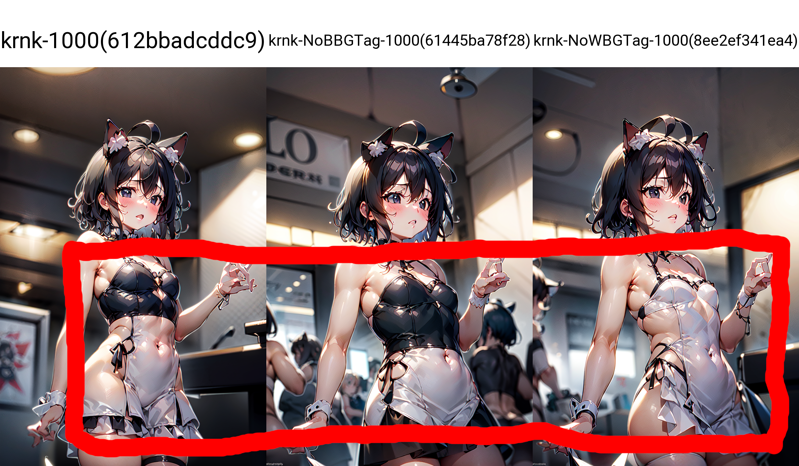
1. 「f0?」なら「from horizontal」、「f1?」なら「from above」、「f2?」なら「from below」
1. 「f?\[01]」なら「from front」、「f?2」なら「from side」、「f?\[34]」なら「from behind」
1. 「upper body」
1. 「standing, straight standing」
1. 「nude, completely nude, bare shoulders」
1. 「f?\[012]」なら「nipples, collarbone, abs, ribs」
	- 胸の大きさをキーワードに学習させるために、「breasts」や「flat chest」を指定していません。
		- 画像生成時に胸のサイズ指定による胸の露出を防ぐ意図があります。
1. 「f?\[34]」なら「shoulder blades, median furrow」
1. 「f1\[012]」か「f2\[01]」なら「navel」
	- テンプレート画像で上からや下の真横(f22)からへそが見えない。手の位置にも依存するのでへそ周りは改善したい。
1. 「f?0」なら「looking at viewer」、「f?0」以外なら「looking away」
1. 「smile, open mouth, blush」
	- この評定指定はイマイチ感。プロンプトの変更時にはタグ付けスクリプトも同様に変更する。

顔の画像の条件は、つまり上記の「学習用自動タグ付けと条件が合致すること」です。
ですので「/GenerateCharTag.ps1」が仕様ですね。

## 顔LoRAの学習

「/GenerateCharToml.bat」で学習用の設定ファイルを生成して、「/Lora.bat」で学習します。
batファイルの先頭に、環境設定用の変数があります。
「Lora.bat」の引数などの利用例は、サンプルLoRAの学習環境を参考にしてください。

よく見るLoRA学習から変更している点です。

- タグをTaggerでつけない
	- タグに合わせて画像を用意するので。
	- 画像の変わる部分は、すなわちキーワードに学習させたい部分。
- タグをシャッフルしない
	- 学習させたいものの順に並べる。
	- 同じ手順で用意したLoRA間で品質を揃えることが目的なので、ランダム要素を減らす。
- 背景キーワードの白黒両方指定
- Tomlの自動生成で、幅や高さが512を超える学習画像のみ、学習解像度も768や1024に上げる。
- save_every_n_epochsはデフォルトでは入れていません。
	- AdamW8ではlr_schedulerでcosine_with_restarts（1回）を指定しており、最後の微調整な学習が失われるのが気になるため（つまり雰囲気、コピペですぐに復活できるようにしてあります）。
	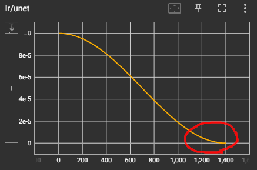

顔LoRAの仕上げに層別マージと圧縮を施します。

- [SuperMergerでLoRAの層別マージ](https://github.com/hako-mikan/sd-webui-supermerger/blob/main/README_ja.md#lora)をします。
	- FACE:0,1,1,1,1,1,0,0,0,1,0,0,0,0,1,0,1,1,1,0,1,1,1,0,0,1
		- 雰囲気。[LoRA Block Weight](https://github.com/hako-mikan/sd-webui-lora-block-weight)でもっといい値があったら教えてください。
		- ただし素材によって適切な値が変わるので注意。例えば猫耳やチョーカーやアホ毛は「TEXTURE SUBJECT（小物）」扱いっぽい。
		- 「BACKGROUND（背景）」と「POSE（ポーズ/構図）」をなるべく避けるようにマージ。
		- 「ANATOMY（人体）」を積むと指が乱れる気がする。
		- 「TEXTURE SUBJECT（小物）」を積むと、過剰な服のシワが現れる気がする。
	- 「LyCORISは単独マージの比率は1,0のみ使用可能です。」との表記があるので注意(Locon?LoHa?)。
		- いくつかを0.5にすることで、よりよいマージができそうな手応えあり。特に体LoRA。
- Kohya版LoRAなら層別マージをした後に「./CompressLoRA.bat」で圧縮します。
	- ノイズのような学習を除去するような効果もあるような気がします。
	- デフォルトではsv_ratio 16で圧縮しますが、差分がパッと見でわからない32や64や128まで圧縮率を下げてもサイズは十分に小さくなります。
	- 圧縮は短時間で終わりますので、高DIMでLoRAを作成してディティールをどこまで残すかを手軽に最終調整できるのもよいですね。
		- 最初にどこまでディティールを残すかを決めるnetwork_dimと異なり、層別マージ後の結果に対してディティールをどこまで残すかを後で判断できるのもよい点です。

# 体LoRAを作る

特定の服を着たキャラの画像を簡単に生成できるように体LoRAを作ります。考え方は顔LoRAと同じです。

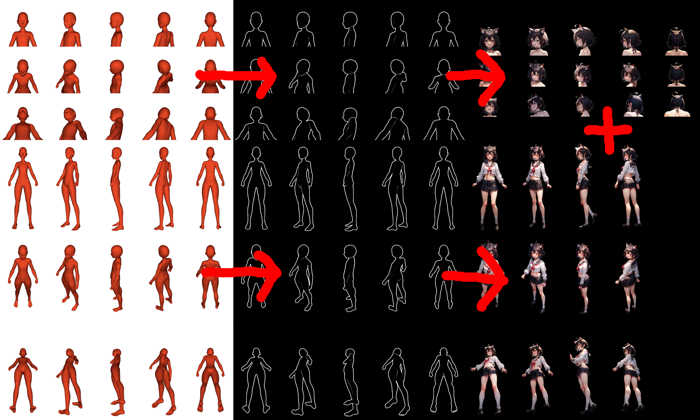

## 体LoRAの学習用画像の条件

基本的には顔と同じで上半身が全身になるだけです。服を着せるので全裸の条件は抜きます。

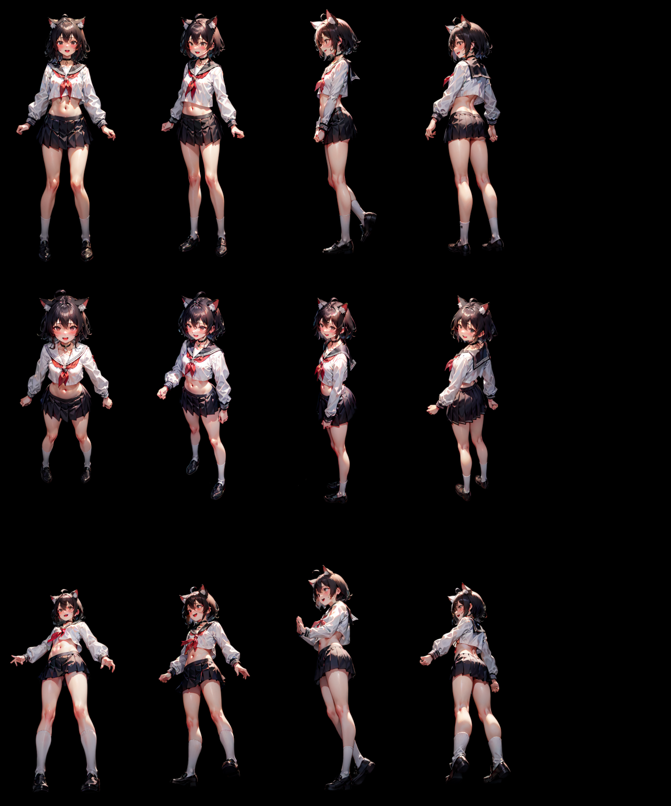

## 体LoRAの学習用画像の生成

学習用画像の生成では「/BodyTemplate」にある「b??.png」をControlNetに設定して、構図が似るように画像を生成します。
ファイル名の1文字目が顔の「f」から体の「b」に変わります。

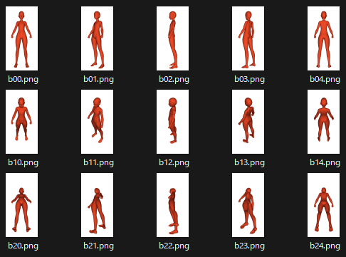

ControlNetも同様にhedを使用します。

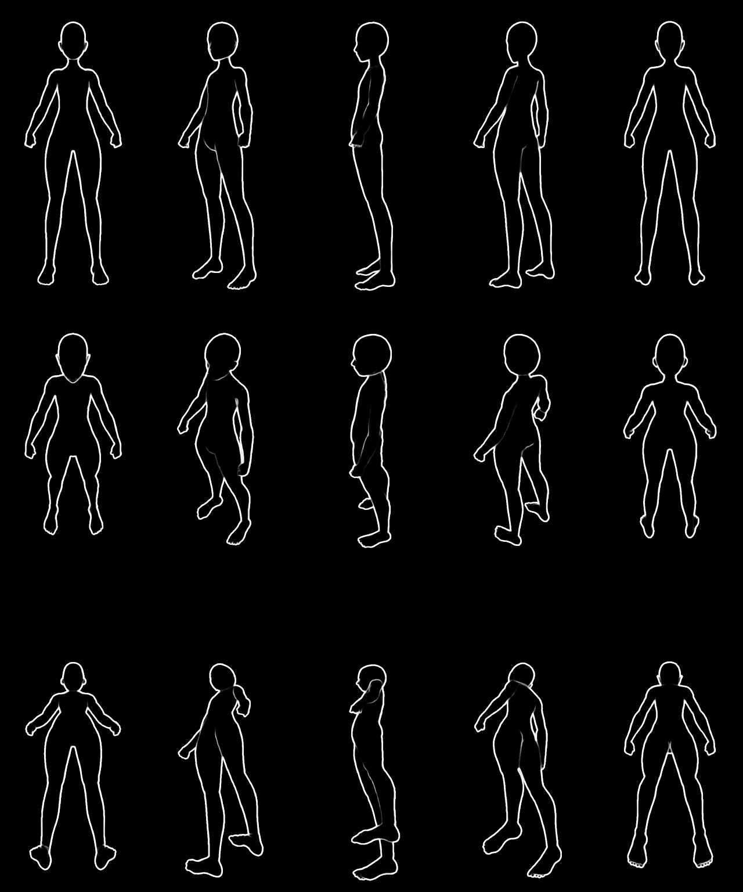

## 体LoRAの学習用画像の生成プロンプト

基本的には顔画像生成と同様の指定をします。

- 「upper body」を「full body」に変更
- なるべく直立してほしいので「standing」や「straight standing」を追加
- 顔は顔LoRAで再現しつつ服装をプロンプトで指定
	- 顔LoRAに含まれているが出にくい要素がもしあれば、追加で弱く指定します。
		- 例えば服の襟と干渉する「(black choker: 0.01)」など。
- 服装のLoRAを使って服装を再現することもできます。

## 体画像の自動タグ付け

顔画像の自動タグ付けから「f??」を「b??」に読み替えて一部を変更します。

- 6.の「upper body」を「full body」に変更
- 全裸が前提となっている、7.から10.の削除

仕様については生成されたタグテキストや「/GenerateCharTag.ps1」を確認すると確実です。
もちろんps1を書き換えて好みのタグを生成することも可能です。

## 体LoRAの学習

顔LoRAの学習と同様に「/GenerateCharToml.bat」で学習用の設定ファイルを生成して、「/Lora.bat」で学習します。

顔LoRAの素材も一緒に学習させて、ひとつのLoRAにまとめています。
顔LoRAのキーワードと体LoRAのキーワードを同一にすることもできますが、顔と体のキーワードに別々でWeightを設定したかったので分けています。
ただし、キーワードのWeightを調整するよりも、顔や体に含まれている要素のタグを追加したほうが効果が大きいため、キーワードを同一にしてしまう選択肢もありそうです。

顔LoRAと同様に、仕上げに層別マージと圧縮を施します。

- 層別マージのパラメータ
	- BODY:0,1,1,1,0,1,0,0,0,1,0,0,0,0,0,0,1,1,1,1,1,1,1,0,0,1
	- LoRA Block Weightでは以下のパラメータも良さそうだったが、層別マージ後の結果が一致せず。たぶんSuperMergerの01限定制約を踏んでる？
		- BODY:0,0.5,0.5,0.5,0,0,0,0,0,1,0,0,0,0.5,0,0,0.5,1,1,0.5,0.5,0.5,0.5,0,0,0.5

# グループLoRAを作る

複数キャラを扱いやすくするために、顔の学習画像と体の学習画像をあわせて体LoRAを作ったように、複数のキャラの学習データをまとめてグループLoRAを作ります。
現状は複数のLoRAを一緒に扱うことが難しく、学習素材が手元にあるのであれば一緒に利用するものをまとめて学習してしまったほうが利用しやすいので作っています。
複数のLoRAを簡単に一緒に扱えるようであれば、不要になります。

キャラを出現させにくい背景LoRAの画像を学習素材に加えてひとつのLoRAにまとめてしまう、といったグループLoRAも同様にできるかもしれません（未検証）。

# コンテンツを作る

コンテンツを作ってみて「こんなはずじゃなかった…」となったら、フレームワークを修正します。

LoRAで複数キャラを取り扱う方法が増えてきたので、一通り検証したいなぁ。
背景LoRAとの組み合わせの調整がうまくできていないので、あわせて改善したいですね。

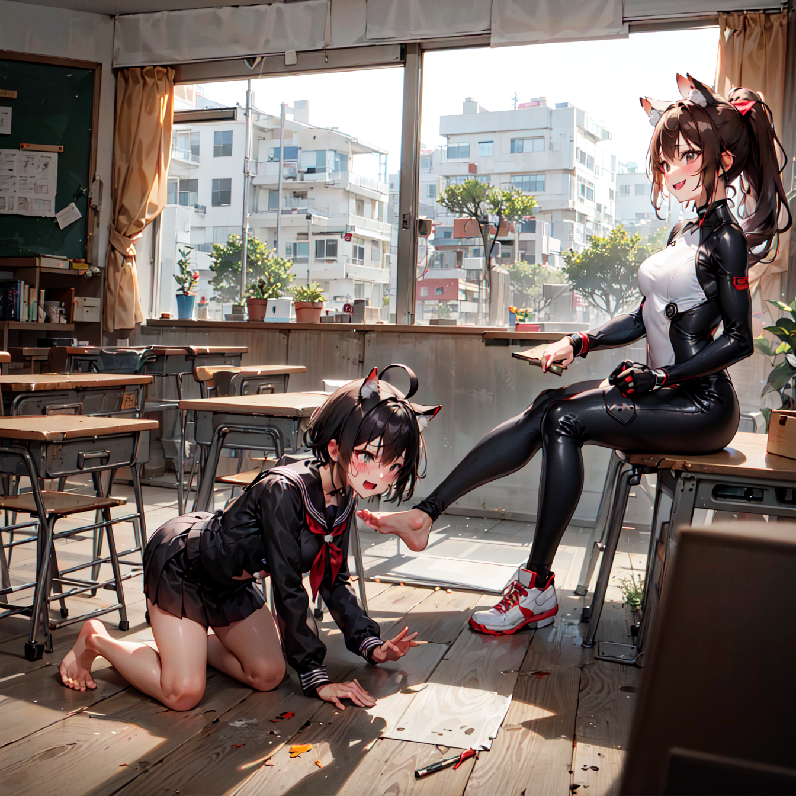
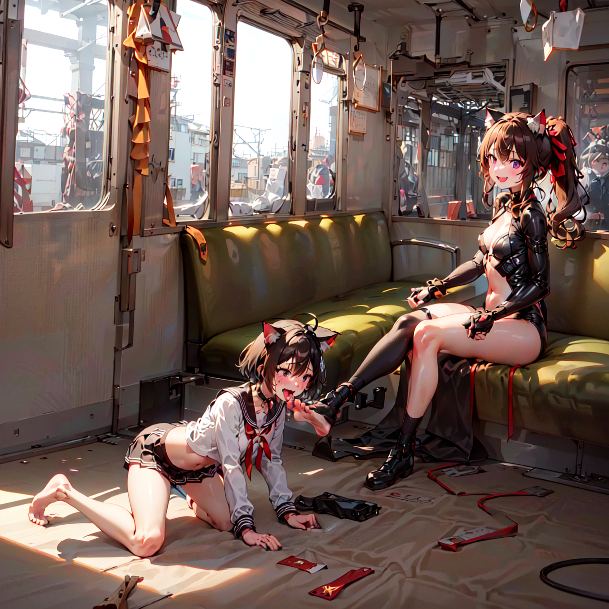
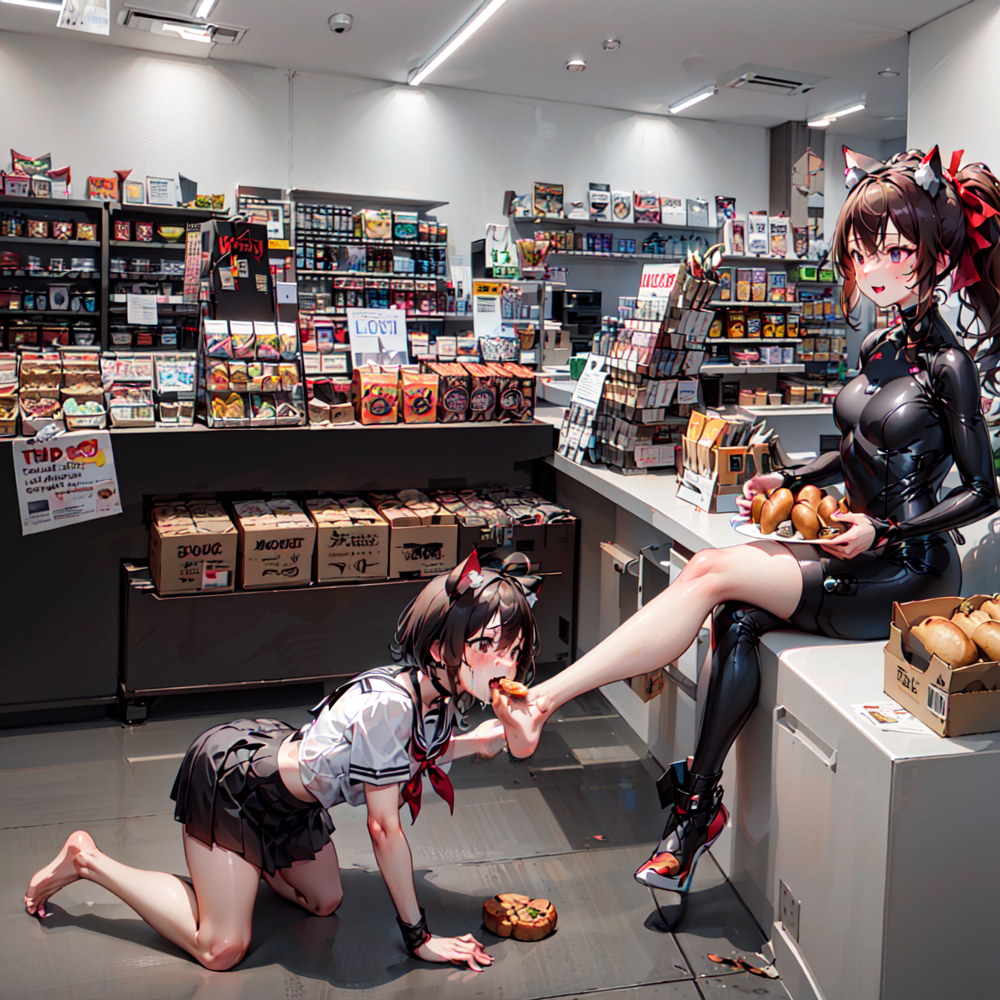
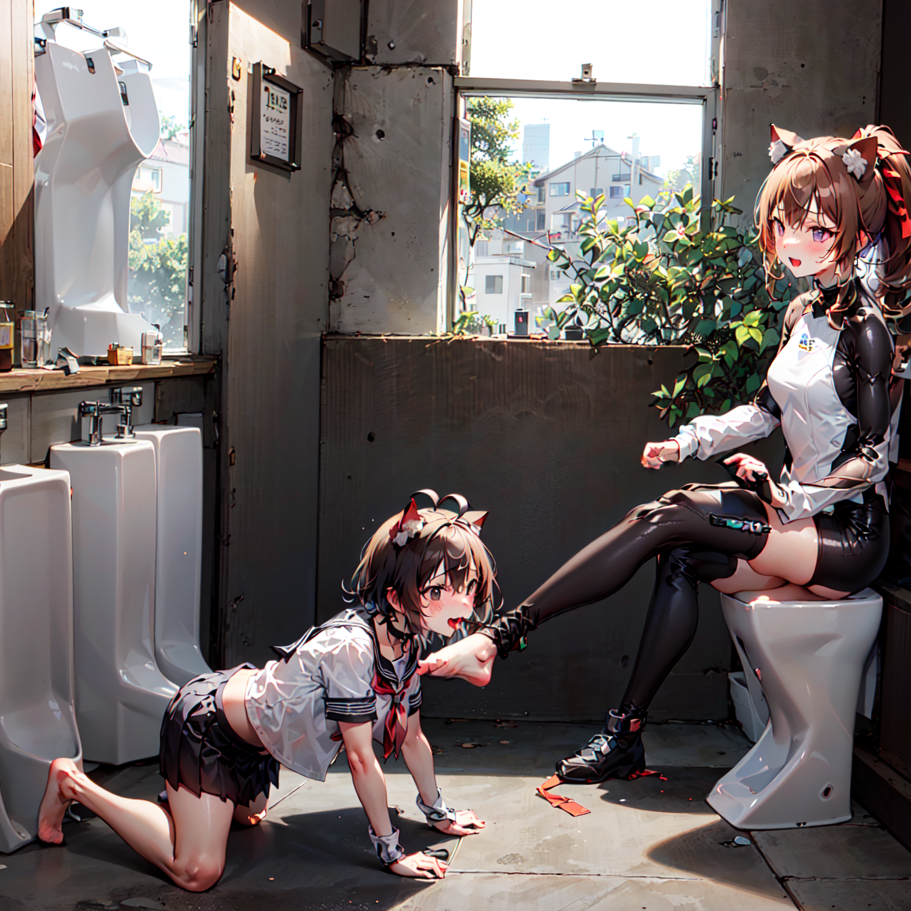

# スクリプトのメモ

リポジトリにあるスクリプトについてのメモ書きです。

## GenerateCharTag.bat

フォルダ名とファイル名から自動でタグ付けします。

- ファイル名やフォルダ名から学習用のタグを自動生成
	- キーワードは画像が入っているフォルダ名の先頭
	- フォルダ名のアンダーバーより前をカンマで区切ったタグとして追加
		- ただし最初のタグはスペースより前をタグ、スペース以降をまとめてclass_tokensとして扱う
	- フォルダ名が「kuronekomimi girl, shorthair, choker, ahoge_f0768/」の場合
		- フォルダ内の画像に追加されるタグ: kuronekomimi, shorthair, choker, ahoge
		- tomlのclass_tokens: kuronekomimi girl
- 複数フォルダのドラッグ＆ドロップが可能

自動生成したタグの例（全裸上半身の正面からの絵）
```
krnk, white background, black background, simple background, from horizontal, from front, upper body, standing, straight standing, nude, completely nude, bare shoulders, nipples, collarbone, abs, ribs, looking at viewer, smile, open mouth, blush
```

## GenerateCharToml.bat

フォルダ名と画像ファイルから自動で学習用設定ファイルを生成します。

- GenerateCharToml.ps1の先頭にコンフィグあり
	- デフォルトでは512x512でバッチ2にしかしない
		- VRAM12GならGenerateCharToml.ps1を次のように書き換える
```ps1
$BATCH_SIZE_TABLE = @{
	"LOW_LOW" = 2;
	#"LOW_LOW" = 4; "MID_LOW" = 3; "LOW_MID" = 3; "MID_MID" = 2; "HIGH_LOW" = 2; "LOW_HIGH" = 2; # VRAM 12GB
};
↓
$BATCH_SIZE_TABLE = @{
	#"LOW_LOW" = 2;
	"LOW_LOW" = 4; "MID_LOW" = 3; "LOW_MID" = 3; "MID_MID" = 2; "HIGH_LOW" = 2; "LOW_HIGH" = 2; # VRAM 12GB
};
```
- 画像サイズによってdatasetを分けている
- class_tokensは画像が入っているフォルダ名先頭のカンマやアンダーバーより前
- フォルダ名に「\_flip\_」や「\_noflip\_」でフリップ有無を切り替え
- 複数フォルダのドラッグ＆ドロップが可能

自動生成したtomlの例:
```toml
[general]
color_aug = true
enable_bucket  = true
bucket_no_upscale = true
caption_extension = '.txt'
num_repeats = 4

[[datasets]]
resolution = [512, 512]
batch_size = 4

[[datasets.subsets]]
image_dir = '..\LoRAInput\4_krnk\krnk girl_f0128'
class_tokens = 'krnk girl'
flip_aug = true

[[datasets.subsets]]
image_dir = '..\LoRAInput\4_krnk\krnk girl_f0192'
class_tokens = 'krnk girl'
flip_aug = true

[[datasets.subsets]]
image_dir = '..\LoRAInput\4_krnk\krnk girl_f0256'
class_tokens = 'krnk girl'
flip_aug = true

[[datasets.subsets]]
image_dir = '..\LoRAInput\4_krnk\krnk girl_f0384'
class_tokens = 'krnk girl'
flip_aug = true

[[datasets.subsets]]
image_dir = '..\LoRAInput\4_krnk\krnk girl_f0512'
class_tokens = 'krnk girl'
flip_aug = true

[[datasets]]
resolution = [768, 768]
batch_size = 2

[[datasets.subsets]]
image_dir = '..\LoRAInput\4_krnk\krnk girl_f0768'
class_tokens = 'krnk girl'
flip_aug = true
```

## GenerateCharTagAndToml.bat

GenerateCharTagとGenerateCharTomlの両方を呼びます。

## InstallSdScripts.bat

[Kohya版LoRAのインストール手順](https://github.com/kohya-ss/sd-scripts/blob/main/README-ja.md#windows%E7%92%B0%E5%A2%83%E3%81%A7%E3%81%AE%E3%82%A4%E3%83%B3%E3%82%B9%E3%83%88%E3%83%BC%E3%83%AB)と同じことをするbatです。

## UpdateSdScripts.bat

[Kohya版LoRAの更新手順](https://github.com/kohya-ss/sd-scripts/blob/main/README-ja.md#%E3%82%A2%E3%83%83%E3%83%97%E3%82%B0%E3%83%AC%E3%83%BC%E3%83%89)と同じことをするbatです。

## InstallLyCORIS.bat

[LyCORIS](https://github.com/KohakuBlueleaf/LyCORIS)のインストール手順と同じことをするbatです。

## LoRA.bat

LoRAの学習をします。

- batの先頭にコンフィグあり
	- デフォルトでは「./LoRAImput」に学習用のモデルを置く設定になっています。
- 引数はロジック、ベースDIM、e-6の整数部で学習率指定、学習ステップ、入力名、出力名、モデル、VAE、ClipSkip、継続学習LoRA（省略可）の順で指定
	- ロジックは (Lora3x3|Lora1x1|Locon|Loha)(A1|A50p)-(AdamW8|AdaFactor)の組み合わせ。
		- A1はアルファ値1、A50pはベースDIMの半分、AdaFactorは学習率を使用しない（がダミーの引数は必要）。
	- text_encoder_lrはベースDIMの44%を切り捨て。

呼び出し例:
```bat
call LoRA Lora3x3A50p-AdamW8 128 100 1000 4_krnk krnk Defmix-v2.0.safetensors kl-f8-anime2.ckpt 2
call LoRA LohaA50p-AdamW8 32 100 1000 4_krnk krnk Defmix-v2.0.safetensors kl-f8-anime2.ckpt 2
```

実行される学習コマンド例:
```bat
accelerate launch train_network.py^
 --network_module=networks.lora^
 --network_args "conv_dim=128" "conv_alpha=64"^
 --optimizer_type=AdamW8bit^
 --learning_rate=100e-6^
 --text_encoder_lr=44e-6^
 --lr_scheduler=cosine_with_restarts^
 --network_dim=128^
 --network_alpha=64^
 --dataset_config="..\LoRAInput\4_krnk\4_krnk.toml"^
 --max_train_steps=1200^
 --output_dir="..\LoRAOutput\krnk"^
 --output_name=krnk-Lora3x3A50p-AdamW8-128-100-1200^
 --pretrained_model_name_or_path="..\LoRAInput\Defmix-v2.0.safetensors"^
 --vae="..\LoRAInput\kl-f8-anime2.ckpt"^
 --clip_skip=2^
 --logging_dir="..\LoRALog"
 --log_prefix=krnk-Lora3x3A50p-AdamW8-128-100-1200^
 --xformers^
 --save_model_as=safetensors^
 --mixed_precision=fp16^
 --save_precision=fp16^
 --gradient_checkpointing^
 --persistent_data_loader_workers^
 --seed=31337
```

## LoRATensorboard.bat

LoRAの学習ログを可視化するTensorboardを立ち上げます。
実行後にコンソールに表示されるURLをCtrl+左クリックします。

## CompressLoRA.bat

Kohya版LoRAをドラッグ＆ドロップすると、sv_ratio=16で圧縮します。
batファイルにある以下のSV_RATIOを32や64にするとより精度を上げられますが、ノイズのような学習を除去してくれている感触があったので意図的に16まで下げています。

```bat
set SV_RATIO=16
```

LoRAの圧縮だけを試してみたい場合は「InstallSdScripts.bat」でsd-scriptsをインストールすれば動くはずです。

# キャラフレームワークの改善

キャラの扱いをフレームワークとしてしくみにする理由は、ここからの継続的な改善にあります。
試行錯誤をその場で使い捨てにせず、資産として残すことが目的です。

- 学習素材の背景への対処
	- キャラの描画に影響がでるhedでなく、openposeで自由にキャラを所定の構図で描きつつ、Multi ControlNetで背景を抑える手法に未来がありそう。
	- Katanukiを使っていたが、新しい「[Rembg](https://github.com/AUTOMATIC1111/stable-diffusion-webui-rembg)」も試してみたい。
	- [Adobe税(1,078円/月)](https://www.adobe.com/jp/creativecloud/photography/compare-plans.html)を支払えば、「[オブジェクト選択ツール](https://www.google.com/search?q=photoshop+%E3%82%AA%E3%83%96%E3%82%B8%E3%82%A7%E3%82%AF%E3%83%88%E9%81%B8%E6%8A%9E%E3%83%84%E3%83%BC%E3%83%AB)」で背景切り抜きで悩まなくて済むようになるかもしれない。
	- もちろん、素材の出どころはツール・ゲーム・手書きなどのいずれでも問題なし。それらなら背景の処理に困らない。
- 複数キャラの取り扱い改善
	- 新技術でグループLoRAが不要になったらいいな。
	- 複数キャラの扱い方が複数あり、追いきれていないので一通り試したい。
	- さらに背景LoRAとの併用が難しい課題もなんとかならないか。
- LoRAの階層マージがのパラメータ追求。
	- 沼。0,1以外の値も使えるようになると更に沼。
- 正則化画像をちゃんと対応してみたい。
	- 学習させたいもの、させたくないものが固定化されているので、カッチリした正則化画像＆正則化タグを用意できそう＆使いまわせそう。
		- ちゃんとやるなら方向別に正則化画像をタグ付きで割り当てたい。やればできそうだけど、正直めんどくさい。
			- コピー機モデルでの[実証](https://note.com/emanon_14/n/ne83063e33627)。やればちゃんと結果がでるっぽい。

きりのよいところまで改善してから公開しようとしたら、試してみたい項目がどんどん出てきて公開がずるずると遅れてしまいました。

# まとめ

手を動かすことで試してみたいことが次々生まれ、かつ新技術もどんどん出てくるので、時間が足りませんね。
「試したいことがあまりない」「目新しい新技術がでてこない」といった状況と比べれば、嬉しい悲鳴です。

# 更新履歴

## 2023/04/02

- LoRA.batの引数にVAEを追加しました。
- GenerateCharTagとGenerateCharTomlで複数タグの追加に対応しました。
- GenerateCharTomlのデフォルトバッチ数を制限しました。
- GenerateCharTagのfully clothedを付与する仕様を削除しました。
	- green skinなどでの悪影響のため。
- sd-scriptsを更新するUpdateSdScripts.batを追加しました。

# ライセンス

[MIT License](./LICENSE.txt)です。

This software is released under the MIT License, see [LICENSE.txt](./LICENSE.txt).
